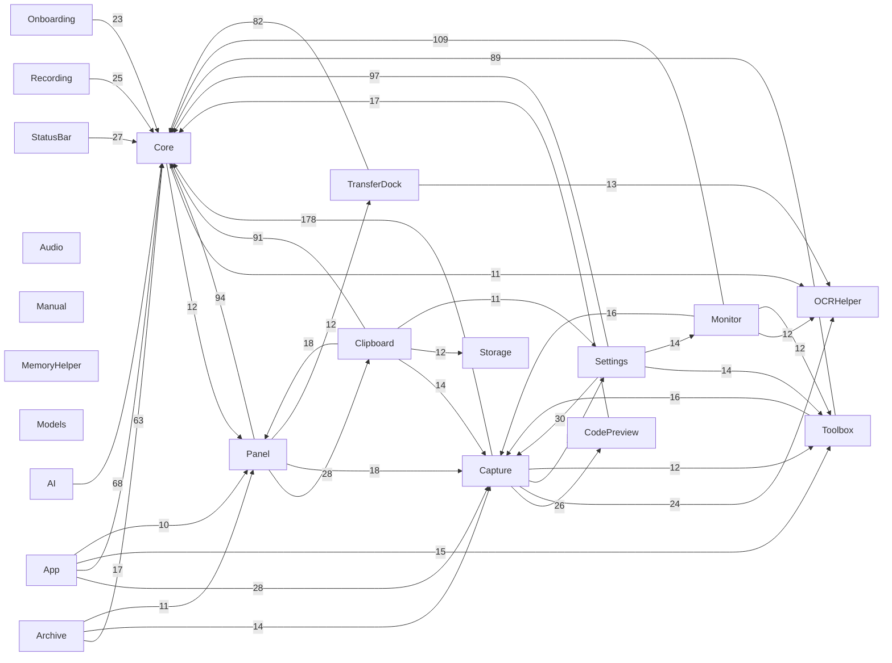

# FrsetNext 模块依赖与规模

> 自动生成，重算：`python3 tools/swift_catalog.py`　共 21 个模块 / 310 文件 / 105,791 行 / 10,092 个声明 / 123 条模块引用边
>
> 成员口径复用 `tools/func_table.py`（唯一解析器）；跨模块边 = 引用到的对方顶层类型数（≥3 才画），import 在单 target 工程里恒为空。

## 模块规模

| 模块 | 文件 | 行数 | 声明 |
|---|---:|---:|---:|
| Capture | 59 | 22,134 | 2047 |
| Monitor | 36 | 13,512 | 1303 |
| TransferDock | 23 | 9,100 | 784 |
| Panel | 21 | 9,013 | 806 |
| Clipboard | 20 | 8,663 | 888 |
| Archive | 19 | 7,869 | 662 |
| Toolbox | 25 | 7,056 | 613 |
| Settings | 19 | 6,774 | 608 |
| Core | 22 | 5,112 | 674 |
| AI | 25 | 4,497 | 520 |
| CodePreview | 7 | 2,199 | 178 |
| Recording | 10 | 2,150 | 225 |
| StatusBar | 7 | 2,120 | 258 |
| Onboarding | 6 | 1,333 | 107 |
| App | 2 | 1,259 | 42 |
| Manual | 2 | 1,100 | 98 |
| Storage | 1 | 669 | 55 |
| Models | 2 | 593 | 144 |
| Audio | 1 | 330 | 37 |
| MemoryHelper | 1 | 184 | 18 |
| OCRHelper | 2 | 124 | 25 |

## 模块依赖（顶层类型被跨模块引用，边权=引用到的类型数）

```mermaid
flowchart LR
  M0["AI"]
  M1["App"]
  M2["Archive"]
  M3["Audio"]
  M4["Capture"]
  M5["Clipboard"]
  M6["CodePreview"]
  M7["Core"]
  M8["Manual"]
  M9["MemoryHelper"]
  M10["Models"]
  M11["Monitor"]
  M12["OCRHelper"]
  M13["Onboarding"]
  M14["Panel"]
  M15["Recording"]
  M16["Settings"]
  M17["StatusBar"]
  M18["Storage"]
  M19["Toolbox"]
  M20["TransferDock"]
  M4 -->|178| M7
  M11 -->|109| M7
  M16 -->|97| M7
  M14 -->|94| M7
  M5 -->|91| M7
  M19 -->|89| M7
  M20 -->|82| M7
  M0 -->|68| M7
  M2 -->|63| M7
  M16 -->|30| M4
  M1 -->|28| M4
  M14 -->|28| M5
  M17 -->|27| M7
  M4 -->|26| M6
  M15 -->|25| M7
  M4 -->|24| M12
  M13 -->|23| M7
  M14 -->|18| M4
  M5 -->|18| M14
  M1 -->|17| M7
  M6 -->|17| M7
  M11 -->|16| M4
  M19 -->|16| M4
  M1 -->|15| M19
  M4 -->|15| M16
  M16 -->|14| M19
  M16 -->|14| M11
  M2 -->|14| M4
  M5 -->|14| M4
  M20 -->|13| M12
  M7 -->|12| M14
  M4 -->|12| M19
  M11 -->|12| M12
  M11 -->|12| M19
  M14 -->|12| M20
  M5 -->|12| M18
  M7 -->|11| M12
  M2 -->|11| M14
  M5 -->|11| M16
  M1 -->|10| M14
```

## 高复杂度成员 Top 30

| 复杂度 | 行数 | 成员 | 位置 |
|---:|---:|---|---|
| 84 | 412 | AppDelegate.application | `App/FrsetNextApp.swift:120` |
| 72 | 39 | CodeLanguageCatalog.detectFromContent | `Features/CodePreview/CodeLanguage.swift:102` |
| 58 | 62 | ShortcutManager.keyText | `Features/Toolbox/Shortcuts/ShortcutManager.swift:233` |
| 46 | 163 | ClipboardBackup.apply | `Features/Clipboard/Store/ClipboardBackup.swift:437` |
| 44 | 190 | LongScreenshotStitcher.searchOffset | `Features/Capture/LongScreenshot/LongScreenshotStitcher.swift:532` |
| 40 | 112 | StatisticsSettingsPane.performImport | `Features/Settings/Panes/StatisticsSettingsPane.swift:435` |
| 40 | 311 | StatsDataProvider.refresh | `Features/Monitor/Sampling/StatsDataProvider.swift:235` |
| 39 | 226 | MermaidRenderer.draw | `Features/Panel/Preview/MermaidRenderer.swift:242` |
| 39 | 97 | CodeLexer.markWordsAndNumbers | `Features/CodePreview/CodeLexer.swift:139` |
| 38 | 113 | ManualDocument.parseBlocks | `Features/Manual/ManualDocument.swift:193` |
| 35 | 19 | PreviewMarkdownRenderer.guessLanguage | `Features/Panel/Preview/PreviewMarkdownRenderer.swift:258` |
| 33 | 57 | SettingsUIState.applyPaneMapping | `Features/Settings/Shell/SettingsWindowController.swift:39` |
| 33 | 125 | LongScreenshotSession.captureTick | `Features/Capture/LongScreenshot/LongScreenshotSession.swift:282` |
| 31 | 142 | ArchiveCore.create | `Features/Archive/Core/ArchiveCore.swift:976` |
| 30 | 194 | Spec.forLanguage | `Features/CodePreview/CodeLexer.swift:379` |
| 29 | 116 | DiskIndexScanner.walk | `Features/Monitor/Storage/DiskIndex.swift:335` |
| 29 | 61 | ClipboardBackup.readManifest | `Features/Clipboard/Store/ClipboardBackup.swift:323` |
| 28 | 209 | StorageManagerRootView.rightPane | `Features/Monitor/Storage/StorageManagerWindow.swift:660` |
| 26 | 71 | AnnotationCompositor.draw | `Features/Capture/Annotation/AnnotationCompositor.swift:254` |
| 26 | 73 | CodeLexer.markCommentsAndStrings | `Features/CodePreview/CodeLexer.swift:63` |
| 25 | 201 | GenieWarp.play | `Core/Motion/GenieWarp.swift:267` |
| 25 | 194 | AnnotationCanvasView.draw | `Features/Capture/Annotation/AnnotationEditorWindow.swift:159` |
| 25 | 136 | PanelController.show | `Features/Panel/Presentation/PanelController.swift:194` |
| 24 | 69 | DiffusionInpainter.sorSolve | `Features/Capture/Annotation/ObjectRemovalEngine.swift:144` |
| 24 | 55 | MermaidRenderer.parse | `Features/Panel/Preview/MermaidRenderer.swift:88` |
| 24 | 59 | ClipboardPreviewWindowController.initialSize | `Features/Clipboard/UI/ClipboardPreviewWindow.swift:55` |
| 23 | 29 | ColorKeyControl.swatch | `Features/Settings/Panes/MonitorWidgetsPane.swift:561` |
| 23 | 109 | AnnotationCanvasView.mouseDown | `Features/Capture/Annotation/AnnotationEditorWindow.swift:416` |
| 23 | 71 | PortInspector.parse | `Features/Monitor/Views/PortInspector.swift:180` |
| 23 | 151 | PreviewMarkdownRenderer.parseSourced | `Features/Panel/Preview/PreviewMarkdownRenderer.swift:88` |
