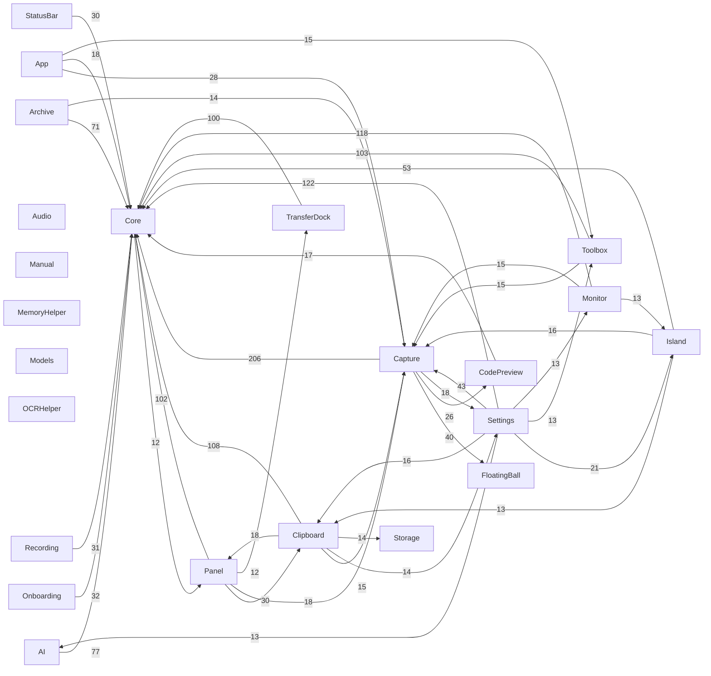

# FrsetNext 模块依赖与规模

> 自动生成，重算：`python3 tools/swift_catalog.py`　共 23 个模块 / 331 文件 / 114,052 行 / 11,328 个声明 / 144 条模块引用边
>
> 成员口径复用 `tools/func_table.py`（唯一解析器）；跨模块边 = 引用到的对方顶层类型数（≥3 才画），import 在单 target 工程里恒为空。

## 模块规模

| 模块 | 文件 | 行数 | 声明 |
|---|---:|---:|---:|
| Capture | 59 | 22,918 | 2124 |
| Monitor | 35 | 12,341 | 1278 |
| Clipboard | 21 | 9,440 | 969 |
| TransferDock | 23 | 9,338 | 822 |
| Panel | 21 | 8,947 | 784 |
| Settings | 22 | 8,075 | 751 |
| Archive | 19 | 8,070 | 678 |
| Toolbox | 25 | 7,460 | 687 |
| Core | 25 | 5,250 | 689 |
| Island | 11 | 4,594 | 688 |
| AI | 25 | 4,439 | 530 |
| Recording | 10 | 2,204 | 232 |
| CodePreview | 7 | 2,201 | 177 |
| StatusBar | 7 | 2,083 | 258 |
| Onboarding | 7 | 1,833 | 158 |
| App | 2 | 1,334 | 48 |
| Manual | 3 | 1,013 | 81 |
| Storage | 1 | 655 | 53 |
| Audio | 2 | 622 | 72 |
| Models | 2 | 600 | 146 |
| FloatingBall | 1 | 327 | 60 |
| MemoryHelper | 1 | 184 | 18 |
| OCRHelper | 2 | 124 | 25 |

## 模块依赖（顶层类型被跨模块引用，边权=引用到的类型数）

```mermaid
flowchart LR
  M0["AI"]
  M1["App"]
  M2["Archive"]
  M3["Audio"]
  M4["Capture"]
  M5["Clipboard"]
  M6["CodePreview"]
  M7["Core"]
  M8["FloatingBall"]
  M9["Island"]
  M10["Manual"]
  M11["MemoryHelper"]
  M12["Models"]
  M13["Monitor"]
  M14["OCRHelper"]
  M15["Onboarding"]
  M16["Panel"]
  M17["Recording"]
  M18["Settings"]
  M19["StatusBar"]
  M20["Storage"]
  M21["Toolbox"]
  M22["TransferDock"]
  M4 -->|206| M7
  M18 -->|122| M7
  M13 -->|118| M7
  M5 -->|108| M7
  M21 -->|103| M7
  M16 -->|102| M7
  M22 -->|100| M7
  M0 -->|77| M7
  M2 -->|71| M7
  M9 -->|53| M7
  M18 -->|43| M4
  M4 -->|40| M8
  M15 -->|32| M7
  M17 -->|31| M7
  M16 -->|30| M5
  M19 -->|30| M7
  M1 -->|28| M4
  M4 -->|26| M6
  M18 -->|21| M9
  M1 -->|18| M7
  M4 -->|18| M18
  M5 -->|18| M16
  M16 -->|18| M4
  M6 -->|17| M7
  M9 -->|16| M4
  M18 -->|16| M5
  M1 -->|15| M21
  M5 -->|15| M4
  M13 -->|15| M4
  M21 -->|15| M4
  M2 -->|14| M4
  M5 -->|14| M18
  M5 -->|14| M20
  M9 -->|13| M5
  M13 -->|13| M9
  M18 -->|13| M21
  M18 -->|13| M13
  M18 -->|13| M0
  M7 -->|12| M16
  M16 -->|12| M22
```

## 高复杂度成员 Top 30

| 复杂度 | 行数 | 成员 | 位置 |
|---:|---:|---|---|
| 87 | 421 | AppDelegate.application | `App/FrsetNextApp.swift:146` |
| 68 | 39 | CodeLanguageCatalog.detectFromContent | `Features/CodePreview/CodeLanguage.swift:102` |
| 58 | 62 | ShortcutManager.keyText | `Features/Toolbox/Shortcuts/ShortcutManager.swift:236` |
| 56 | 93 | StatisticsSettingsPane.applyImportedPreferences | `Features/Settings/Panes/StatisticsSettingsPane.swift:271` |
| 50 | 76 | SettingsUIState.applyPaneMapping | `Features/Settings/Shell/SettingsWindowController.swift:52` |
| 46 | 170 | ClipboardBackup.apply | `Features/Clipboard/Store/ClipboardBackup.swift:484` |
| 44 | 190 | LongScreenshotStitcher.searchOffset | `Features/Capture/LongScreenshot/LongScreenshotStitcher.swift:532` |
| 41 | 95 | CodeLexer.markWordsAndNumbers | `Features/CodePreview/CodeLexer.swift:142` |
| 39 | 286 | StatsDataProvider.refresh | `Features/Monitor/Sampling/StatsDataProvider.swift:234` |
| 39 | 226 | MermaidRenderer.draw | `Features/Panel/Preview/MermaidRenderer.swift:242` |
| 35 | 18 | PreviewMarkdownRenderer.detectLanguage | `Features/Panel/Preview/PreviewMarkdownRenderer.swift:257` |
| 33 | 125 | LongScreenshotSession.captureTick | `Features/Capture/LongScreenshot/LongScreenshotSession.swift:282` |
| 31 | 142 | ArchiveCore.create | `Features/Archive/Core/ArchiveCore.swift:998` |
| 31 | 61 | ClipboardManager.copy | `Features/Clipboard/Store/ClipboardManager.swift:650` |
| 31 | 80 | IslandRootView.loadRecords | `Features/Island/IslandContent.swift:436` |
| 30 | 64 | ClipboardBackup.readManifest | `Features/Clipboard/Store/ClipboardBackup.swift:362` |
| 30 | 193 | Spec.forLanguage | `Features/CodePreview/CodeLexer.swift:374` |
| 30 | 76 | IslandController.installMonitors | `Features/Island/IslandController.swift:641` |
| 30 | 135 | DiskIndexScanner.walk | `Features/Monitor/Storage/DiskIndex.swift:517` |
| 29 | 46 | CaptureSettingsDraft.save | `Features/Capture/Screenshot/CaptureSettingsPane.swift:58` |
| 29 | 189 | SearchSectionView.webResultArea | `Features/Toolbox/Search/SearchSectionView.swift:1133` |
| 28 | 75 | IslandController.updatePointer | `Features/Island/IslandController.swift:718` |
| 27 | 85 | FloatingClipboardWindowController.installKeyMonitor | `Features/Clipboard/Floating/FloatingClipboardWindow.swift:346` |
| 26 | 71 | AnnotationCompositor.draw | `Features/Capture/Annotation/AnnotationCompositor.swift:254` |
| 26 | 75 | ManualDocument.parseBlocks | `Features/Manual/ManualDocument.swift:154` |
| 25 | 201 | GenieWarp.play | `Core/Motion/GenieWarp.swift:272` |
| 25 | 194 | AnnotationCanvasView.draw | `Features/Capture/Annotation/AnnotationEditorWindow.swift:160` |
| 25 | 71 | CodeLexer.markCommentsAndStrings | `Features/CodePreview/CodeLexer.swift:68` |
| 25 | 136 | PanelController.show | `Features/Panel/Presentation/PanelController.swift:194` |
| 25 | 71 | PreviewPopoverContentModel.init | `Features/Panel/Preview/PreviewPopoverContentModel.swift:66` |
