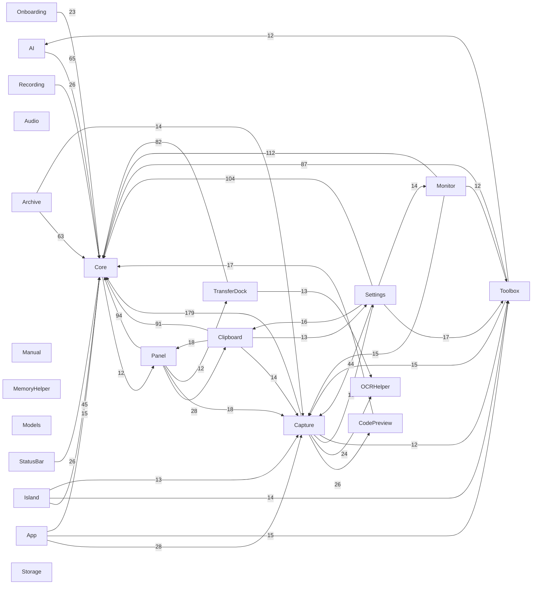

# FrsetNext 模块依赖与规模

> 自动生成，重算：`python3 tools/swift_catalog.py`　共 22 个模块 / 325 文件 / 111,569 行 / 11,108 个声明 / 137 条模块引用边
>
> 成员口径复用 `tools/func_table.py`（唯一解析器）；跨模块边 = 引用到的对方顶层类型数（≥3 才画），import 在单 target 工程里恒为空。

## 模块规模

| 模块 | 文件 | 行数 | 声明 |
|---|---:|---:|---:|
| Capture | 59 | 22,278 | 2070 |
| Monitor | 37 | 13,726 | 1395 |
| TransferDock | 23 | 9,128 | 808 |
| Panel | 21 | 9,044 | 808 |
| Clipboard | 20 | 8,775 | 912 |
| Archive | 19 | 7,869 | 662 |
| Settings | 20 | 7,585 | 722 |
| Toolbox | 25 | 7,407 | 679 |
| Core | 24 | 5,128 | 683 |
| AI | 25 | 4,322 | 522 |
| Island | 10 | 3,870 | 603 |
| Recording | 10 | 2,228 | 240 |
| CodePreview | 7 | 2,199 | 178 |
| StatusBar | 7 | 2,073 | 256 |
| Onboarding | 6 | 1,333 | 107 |
| App | 2 | 1,310 | 47 |
| Manual | 2 | 1,100 | 98 |
| Storage | 1 | 674 | 56 |
| Audio | 2 | 619 | 75 |
| Models | 2 | 593 | 144 |
| MemoryHelper | 1 | 184 | 18 |
| OCRHelper | 2 | 124 | 25 |

## 模块依赖（顶层类型被跨模块引用，边权=引用到的类型数）

```mermaid
flowchart LR
  M0["AI"]
  M1["App"]
  M2["Archive"]
  M3["Audio"]
  M4["Capture"]
  M5["Clipboard"]
  M6["CodePreview"]
  M7["Core"]
  M8["Island"]
  M9["Manual"]
  M10["MemoryHelper"]
  M11["Models"]
  M12["Monitor"]
  M13["OCRHelper"]
  M14["Onboarding"]
  M15["Panel"]
  M16["Recording"]
  M17["Settings"]
  M18["StatusBar"]
  M19["Storage"]
  M20["Toolbox"]
  M21["TransferDock"]
  M4 -->|179| M7
  M12 -->|112| M7
  M17 -->|104| M7
  M15 -->|94| M7
  M5 -->|91| M7
  M20 -->|87| M7
  M21 -->|82| M7
  M0 -->|65| M7
  M2 -->|63| M7
  M8 -->|45| M7
  M17 -->|44| M4
  M1 -->|28| M4
  M15 -->|28| M5
  M4 -->|26| M6
  M18 -->|26| M7
  M16 -->|26| M7
  M4 -->|24| M13
  M14 -->|23| M7
  M4 -->|18| M17
  M15 -->|18| M4
  M5 -->|18| M15
  M17 -->|17| M20
  M6 -->|17| M7
  M17 -->|16| M5
  M1 -->|15| M20
  M1 -->|15| M7
  M12 -->|15| M4
  M20 -->|15| M4
  M17 -->|14| M12
  M2 -->|14| M4
  M8 -->|14| M20
  M5 -->|14| M4
  M8 -->|13| M4
  M21 -->|13| M13
  M5 -->|13| M17
  M7 -->|12| M15
  M4 -->|12| M20
  M12 -->|12| M20
  M15 -->|12| M21
  M20 -->|12| M0
```

## 高复杂度成员 Top 30

| 复杂度 | 行数 | 成员 | 位置 |
|---:|---:|---|---|
| 87 | 419 | AppDelegate.application | `App/FrsetNextApp.swift:124` |
| 72 | 39 | CodeLanguageCatalog.detectFromContent | `Features/CodePreview/CodeLanguage.swift:102` |
| 58 | 62 | ShortcutManager.keyText | `Features/Toolbox/Shortcuts/ShortcutManager.swift:236` |
| 57 | 91 | StatisticsSettingsPane.applyImportedPreferences | `Features/Settings/Panes/StatisticsSettingsPane.swift:465` |
| 48 | 74 | SettingsUIState.applyPaneMapping | `Features/Settings/Shell/SettingsWindowController.swift:52` |
| 46 | 163 | ClipboardBackup.apply | `Features/Clipboard/Store/ClipboardBackup.swift:493` |
| 44 | 190 | LongScreenshotStitcher.searchOffset | `Features/Capture/LongScreenshot/LongScreenshotStitcher.swift:532` |
| 40 | 311 | StatsDataProvider.refresh | `Features/Monitor/Sampling/StatsDataProvider.swift:235` |
| 39 | 226 | MermaidRenderer.draw | `Features/Panel/Preview/MermaidRenderer.swift:242` |
| 39 | 97 | CodeLexer.markWordsAndNumbers | `Features/CodePreview/CodeLexer.swift:139` |
| 38 | 113 | ManualDocument.parseBlocks | `Features/Manual/ManualDocument.swift:193` |
| 35 | 19 | PreviewMarkdownRenderer.guessLanguage | `Features/Panel/Preview/PreviewMarkdownRenderer.swift:258` |
| 33 | 125 | LongScreenshotSession.captureTick | `Features/Capture/LongScreenshot/LongScreenshotSession.swift:282` |
| 31 | 142 | ArchiveCore.create | `Features/Archive/Core/ArchiveCore.swift:976` |
| 30 | 135 | DiskIndexScanner.walk | `Features/Monitor/Storage/DiskIndex.swift:521` |
| 30 | 194 | Spec.forLanguage | `Features/CodePreview/CodeLexer.swift:379` |
| 30 | 64 | ClipboardBackup.readManifest | `Features/Clipboard/Store/ClipboardBackup.swift:372` |
| 29 | 46 | CaptureSettingsDraft.save | `Features/Capture/Screenshot/CaptureSettingsPane.swift:58` |
| 26 | 71 | AnnotationCompositor.draw | `Features/Capture/Annotation/AnnotationCompositor.swift:254` |
| 26 | 73 | CodeLexer.markCommentsAndStrings | `Features/CodePreview/CodeLexer.swift:63` |
| 25 | 201 | GenieWarp.play | `Core/Motion/GenieWarp.swift:267` |
| 25 | 194 | AnnotationCanvasView.draw | `Features/Capture/Annotation/AnnotationEditorWindow.swift:159` |
| 25 | 136 | PanelController.show | `Features/Panel/Presentation/PanelController.swift:194` |
| 24 | 69 | DiffusionInpainter.sorSolve | `Features/Capture/Annotation/ObjectRemovalEngine.swift:144` |
| 24 | 55 | MermaidRenderer.parse | `Features/Panel/Preview/MermaidRenderer.swift:88` |
| 24 | 175 | SearchSectionView.webResultArea | `Features/Toolbox/Search/SearchSectionView.swift:1093` |
| 24 | 74 | IslandRootView.loadRecords | `Features/Island/IslandContent.swift:336` |
| 24 | 59 | ClipboardPreviewWindowController.initialSize | `Features/Clipboard/UI/ClipboardPreviewWindow.swift:55` |
| 23 | 29 | ColorKeyControl.swatch | `Features/Settings/Panes/MonitorWidgetsPane.swift:692` |
| 23 | 109 | AnnotationCanvasView.mouseDown | `Features/Capture/Annotation/AnnotationEditorWindow.swift:416` |
