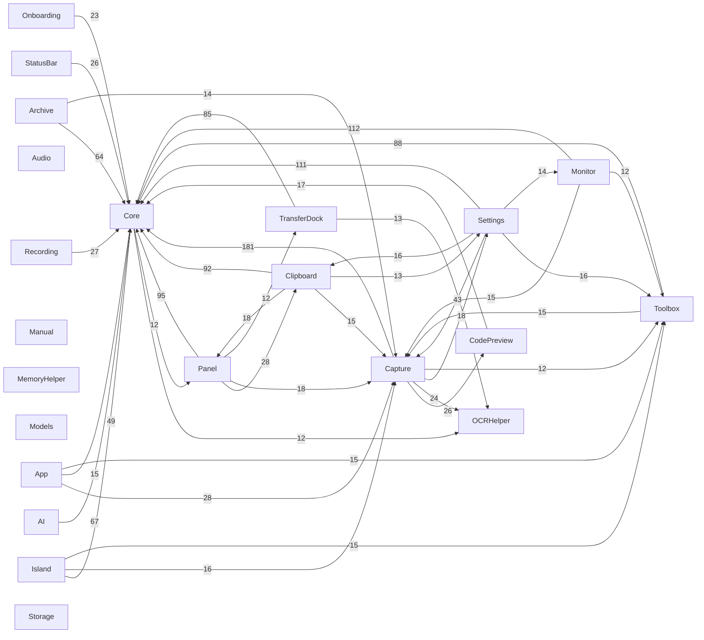

# FrsetNext 模块依赖与规模

> 自动生成，重算：`python3 tools/swift_catalog.py`　共 22 个模块 / 330 文件 / 112,971 行 / 11,188 个声明 / 138 条模块引用边
>
> 成员口径复用 `tools/func_table.py`（唯一解析器）；跨模块边 = 引用到的对方顶层类型数（≥3 才画），import 在单 target 工程里恒为空。

## 模块规模

| 模块 | 文件 | 行数 | 声明 |
|---|---:|---:|---:|
| Capture | 59 | 22,588 | 2088 |
| Monitor | 37 | 13,726 | 1395 |
| TransferDock | 23 | 9,252 | 816 |
| Panel | 21 | 9,041 | 801 |
| Clipboard | 20 | 8,819 | 909 |
| Archive | 19 | 7,990 | 672 |
| Settings | 21 | 7,729 | 734 |
| Toolbox | 25 | 7,421 | 681 |
| Core | 25 | 5,211 | 695 |
| AI | 25 | 4,337 | 522 |
| Island | 11 | 4,222 | 639 |
| Recording | 10 | 2,242 | 240 |
| CodePreview | 7 | 2,199 | 178 |
| StatusBar | 7 | 2,073 | 256 |
| Onboarding | 6 | 1,333 | 107 |
| App | 2 | 1,332 | 48 |
| Manual | 4 | 1,287 | 92 |
| Storage | 1 | 637 | 53 |
| Audio | 2 | 631 | 75 |
| Models | 2 | 593 | 144 |
| MemoryHelper | 1 | 184 | 18 |
| OCRHelper | 2 | 124 | 25 |

## 模块依赖（顶层类型被跨模块引用，边权=引用到的类型数）

```mermaid
flowchart LR
  M0["AI"]
  M1["App"]
  M2["Archive"]
  M3["Audio"]
  M4["Capture"]
  M5["Clipboard"]
  M6["CodePreview"]
  M7["Core"]
  M8["Island"]
  M9["Manual"]
  M10["MemoryHelper"]
  M11["Models"]
  M12["Monitor"]
  M13["OCRHelper"]
  M14["Onboarding"]
  M15["Panel"]
  M16["Recording"]
  M17["Settings"]
  M18["StatusBar"]
  M19["Storage"]
  M20["Toolbox"]
  M21["TransferDock"]
  M4 -->|181| M7
  M12 -->|112| M7
  M17 -->|111| M7
  M15 -->|95| M7
  M5 -->|92| M7
  M20 -->|88| M7
  M21 -->|85| M7
  M0 -->|67| M7
  M2 -->|64| M7
  M8 -->|49| M7
  M17 -->|43| M4
  M1 -->|28| M4
  M15 -->|28| M5
  M16 -->|27| M7
  M4 -->|26| M6
  M18 -->|26| M7
  M4 -->|24| M13
  M14 -->|23| M7
  M4 -->|18| M17
  M15 -->|18| M4
  M5 -->|18| M15
  M6 -->|17| M7
  M17 -->|16| M20
  M17 -->|16| M5
  M8 -->|16| M4
  M1 -->|15| M7
  M1 -->|15| M20
  M12 -->|15| M4
  M20 -->|15| M4
  M8 -->|15| M20
  M5 -->|15| M4
  M17 -->|14| M12
  M2 -->|14| M4
  M21 -->|13| M13
  M5 -->|13| M17
  M7 -->|12| M13
  M7 -->|12| M15
  M4 -->|12| M20
  M12 -->|12| M20
  M15 -->|12| M21
```

## 高复杂度成员 Top 30

| 复杂度 | 行数 | 成员 | 位置 |
|---:|---:|---|---|
| 87 | 419 | AppDelegate.application | `App/FrsetNextApp.swift:146` |
| 72 | 39 | CodeLanguageCatalog.detectFromContent | `Features/CodePreview/CodeLanguage.swift:102` |
| 58 | 62 | ShortcutManager.keyText | `Features/Toolbox/Shortcuts/ShortcutManager.swift:236` |
| 57 | 91 | StatisticsSettingsPane.applyImportedPreferences | `Features/Settings/Panes/StatisticsSettingsPane.swift:271` |
| 49 | 75 | SettingsUIState.applyPaneMapping | `Features/Settings/Shell/SettingsWindowController.swift:52` |
| 46 | 163 | ClipboardBackup.apply | `Features/Clipboard/Store/ClipboardBackup.swift:491` |
| 44 | 190 | LongScreenshotStitcher.searchOffset | `Features/Capture/LongScreenshot/LongScreenshotStitcher.swift:532` |
| 40 | 311 | StatsDataProvider.refresh | `Features/Monitor/Sampling/StatsDataProvider.swift:235` |
| 39 | 226 | MermaidRenderer.draw | `Features/Panel/Preview/MermaidRenderer.swift:242` |
| 39 | 97 | CodeLexer.markWordsAndNumbers | `Features/CodePreview/CodeLexer.swift:139` |
| 35 | 19 | PreviewMarkdownRenderer.guessLanguage | `Features/Panel/Preview/PreviewMarkdownRenderer.swift:258` |
| 33 | 125 | LongScreenshotSession.captureTick | `Features/Capture/LongScreenshot/LongScreenshotSession.swift:282` |
| 31 | 142 | ArchiveCore.create | `Features/Archive/Core/ArchiveCore.swift:989` |
| 30 | 135 | DiskIndexScanner.walk | `Features/Monitor/Storage/DiskIndex.swift:521` |
| 30 | 194 | Spec.forLanguage | `Features/CodePreview/CodeLexer.swift:379` |
| 30 | 64 | ClipboardBackup.readManifest | `Features/Clipboard/Store/ClipboardBackup.swift:370` |
| 29 | 46 | CaptureSettingsDraft.save | `Features/Capture/Screenshot/CaptureSettingsPane.swift:58` |
| 27 | 70 | IslandController.installMonitors | `Features/Island/IslandController.swift:535` |
| 27 | 85 | FloatingClipboardWindowController.installKeyMonitor | `Features/Clipboard/Floating/FloatingClipboardWindow.swift:346` |
| 26 | 71 | AnnotationCompositor.draw | `Features/Capture/Annotation/AnnotationCompositor.swift:254` |
| 26 | 73 | CodeLexer.markCommentsAndStrings | `Features/CodePreview/CodeLexer.swift:63` |
| 26 | 75 | ManualDocument.parseBlocks | `Features/Manual/ManualDocument.swift:164` |
| 25 | 201 | GenieWarp.play | `Core/Motion/GenieWarp.swift:267` |
| 25 | 194 | AnnotationCanvasView.draw | `Features/Capture/Annotation/AnnotationEditorWindow.swift:159` |
| 25 | 136 | PanelController.show | `Features/Panel/Presentation/PanelController.swift:194` |
| 24 | 69 | DiffusionInpainter.sorSolve | `Features/Capture/Annotation/ObjectRemovalEngine.swift:144` |
| 24 | 55 | MermaidRenderer.parse | `Features/Panel/Preview/MermaidRenderer.swift:88` |
| 24 | 175 | SearchSectionView.webResultArea | `Features/Toolbox/Search/SearchSectionView.swift:1095` |
| 24 | 74 | IslandRootView.loadRecords | `Features/Island/IslandContent.swift:341` |
| 24 | 63 | IslandController.updatePointer | `Features/Island/IslandController.swift:606` |
